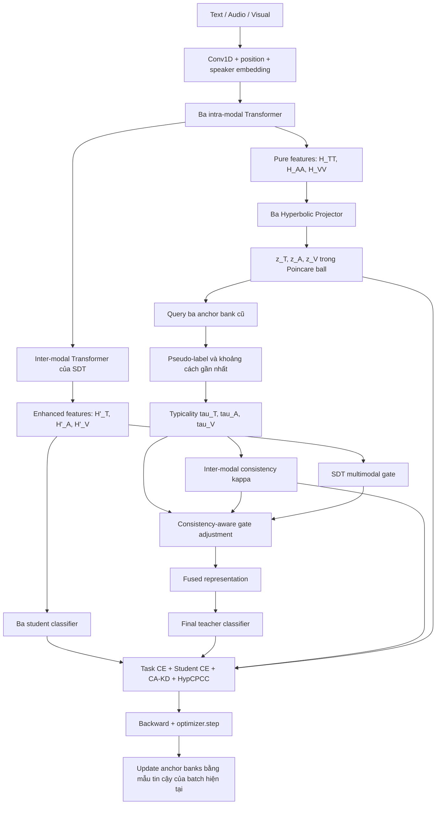

# Giải thích chi tiết mô hình SDT + TiCAL ở chế độ `full`

Tài liệu này mô tả **đúng implementation hiện tại trong `SDT_new`** khi chạy:

```bash
TICAL_MODE=full bash SDT_new/exec_iemocap_tical.sh --device cuda --gpu-id 0
```

Lệnh trên tương đương với việc bật:

```text
use_tical = true
tical_mode = full
fusion_variant = sdt
```

Trong chế độ này, mô hình gồm SDT gốc và ba cơ chế học thêm từ TiCAL:

1. **Consistency-aware self-distillation:** dùng consistency `kappa` để điều chỉnh loss KD theo từng utterance.
2. **HypCPCC:** ép cấu trúc khoảng cách hyperbolic phù hợp với quan hệ giữa các pseudo-label.
3. **Consistency-aware fusion:** dùng typicality và consistency để điều chỉnh gate fusion gốc của SDT.

COLD bị vô hiệu hóa: không có Gaussian distribution head, không sampling latent,
không có COLD loss và không dùng OOF reliability/pruning.

---

## 1. Sơ đồ toàn bộ pipeline



Ký hiệu shape được dùng trong tài liệu:

```text
B = số dialogue trong batch
L = chiều dài dialogue lớn nhất trong batch
H = hidden_dim, mặc định 1024
U = tổng số utterance hợp lệ trong batch
C = số emotion class, IEMOCAP có 6 class
D_h = hyperbolic_dim, mặc định 128
```

Mọi phép tính TiCAL chỉ lấy vị trí có `valid_mask=True`. Padding không được query,
không tham gia typicality, `kappa`, loss hoặc anchor bank.

---

## 2. Phần SDT được giữ nguyên

### Bước 2.1: Chuẩn hóa chiều feature

Ba input có số chiều khác nhau:

```text
textf   [L, B, D_text]
acouf   [L, B, D_audio]
visuf   [L, B, D_visual]
```

Mỗi modality đi qua một Conv1D kernel size 1 để đưa về cùng `hidden_dim=H`:

\[
X_T, X_A, X_V \in \mathbb{R}^{B\times L\times H}.
\]

SDT tiếp tục thêm positional encoding và speaker embedding như code gốc.

### Bước 2.2: Tạo ba pure unimodal representations

Ba intra-modal Transformer chỉ cho một modality attention với chính nó:

\[
H_{T\rightarrow T}=\operatorname{Transformer}(X_T,X_T,X_T),
\]

\[
H_{A\rightarrow A}=\operatorname{Transformer}(X_A,X_A,X_A),
\]

\[
H_{V\rightarrow V}=\operatorname{Transformer}(X_V,X_V,X_V).
\]

Implementation gọi chúng là:

```text
pure_t = H_TT
pure_a = H_AA
pure_v = H_VV
```

TiCAL lấy feature tại đúng điểm này, trước unimodal gate và trước khi thông tin từ
modality khác được trộn vào. Các tensor `pure_*` không bị `detach()` trong forward.

### Bước 2.3: SDT tạo enhanced representations

SDT vẫn chạy sáu inter-modal Transformer còn lại. Ví dụ nhánh đích text nhận thêm:

\[
H_{A\rightarrow T},\qquad H_{V\rightarrow T}.
\]

Sau unimodal gated fusion, concatenate và feature reduction, mô hình có:

\[
H'_T,\quad H'_A,\quad H'_V
\in\mathbb{R}^{B\times L\times H}.
\]

Ba `H'_m` tiếp tục được dùng cho student classifiers và multimodal fusion như SDT.
TiCAL không thay thế các representation này bằng hyperbolic feature.

### Bước 2.4: Ba student classifier

Mỗi enhanced representation đi qua student classifier riêng:

\[
s_T=f_T(H'_T),\quad s_A=f_A(H'_A),\quad s_V=f_V(H'_V).
\]

Mỗi classifier vẫn có cấu trúc của SDT:

```text
ReLU -> Dropout -> Linear(H, C)
```

Student hard-label CE được giữ nguyên trong tất cả TiCAL mode.

---

## 3. Hyperbolic projection của TiCAL

TiCAL có ba projector độc lập:

```text
projector_t
projector_a
projector_v
```

Với mỗi pure feature, trước hết Linear layer tạo vector tangent:

\[
u_m=W_mH_{m\rightarrow m}+b_m.
\]

Sau đó vector được ánh xạ vào Poincaré ball:

\[
z_m=\tanh(\|u_m\|)\frac{u_m}{\|u_m\|}.
\]

Kết quả:

\[
z_T,z_A,z_V\in\mathbb{R}^{B\times L\times D_h},
\qquad \|z_m\|<1.
\]

Projector được khởi tạo gần tâm của Poincaré ball để tránh các vector vừa khởi
tạo đã nằm sát biên, nơi khoảng cách hyperbolic có thể tăng rất lớn.

Khoảng cách giữa hai vector trong Poincaré ball được tính bằng:

\[
d_{\mathbb B}(x,y)=
\operatorname{arcosh}\left(
1+2\frac{\|x-y\|^2}
{(1-\|x\|^2)(1-\|y\|^2)}
\right).
\]

Code clamp norm, denominator và đối số của `acosh` để tránh NaN/Inf.

---

## 4. Ba High-confidence Anchor Sample Lists

Mỗi modality có một FIFO anchor bank riêng:

```text
anchor_bank_t
anchor_bank_a
anchor_bank_v
```

Mỗi phần tử lưu:

```text
(projected pure feature z_m, ground-truth label)
```

Kích thước mặc định của mỗi bank là 2048. Khi bank đầy, anchor cũ nhất bị loại.

### Điều kiện thêm anchor

Từ fused teacher logits, mô hình tính:

\[
p_i=\operatorname{softmax}(\text{teacher logits}_i),
\]

\[
\hat y_i=\arg\max_c p_{ic},
\qquad q_i=\max_c p_{ic}.
\]

Utterance `i` chỉ đủ điều kiện nếu:

\[
\hat y_i=y_i
\quad\text{và}\quad
q_i>\theta,
\]

với mặc định:

\[
\theta=0.8.
\]

Nếu đủ điều kiện, ba feature của utterance đó được đưa vào ba bank tương ứng:

```text
(z_t, label) -> anchor_bank_t
(z_a, label) -> anchor_bank_a
(z_v, label) -> anchor_bank_v
```

Ba bank thường có cùng số lượng và class count vì dùng chung điều kiện teacher,
nhưng feature hình học lưu trong từng bank khác nhau.

### Thứ tự chống self-nearest-neighbor leakage

Batch hiện tại không được thêm vào bank trước khi query. Thứ tự trong code là:

```text
1. Forward và project batch hiện tại
2. Query các anchor đã có từ trước
3. Tính tau, kappa và loss
4. Backward
5. optimizer.step()
6. Detach feature của batch hiện tại
7. Update anchor banks
```

Nhờ vậy, một utterance không thể query chính nó và nhận khoảng cách gần nhất bằng 0.

---

## 5. Warm-up 5 epoch đầu

Mặc định:

```text
tical_warmup_epochs = 5
```

Trong epoch 1 đến epoch 5:

- SDT train bằng task CE, student CE và KL gốc.
- Multimodal fusion vẫn là gate SDT gốc.
- TiCAL chưa weight KD và chưa điều chỉnh fusion.
- HypCPCC chưa được cộng vào loss.
- Những utterance teacher dự đoán đúng với confidence trên 0.8 vẫn được thêm vào anchor banks.

TiCAL bắt đầu query bank và tác động lên mô hình từ epoch 6.

Nếu sau warm-up chưa có anchor do threshold quá cao, TiCAL tiếp tục dùng loss/fusion
SDT cho tới khi bank có dữ liệu. Log `tical_ready_rate` cho biết tỷ lệ utterance
trong epoch thực sự đã tính được TiCAL.

---

## 6. Query anchor và tạo pseudo-label theo modality

Sau warm-up, mỗi projected feature query bank của chính modality đó:

\[
(d_{Ti},y^*_{Ti})=
\operatorname{nearest}(z_{Ti},\mathcal A_T),
\]

\[
(d_{Ai},y^*_{Ai})=
\operatorname{nearest}(z_{Ai},\mathcal A_A),
\]

\[
(d_{Vi},y^*_{Vi})=
\operatorname{nearest}(z_{Vi},\mathcal A_V).
\]

Trong đó:

- `d_mi` là hyperbolic distance tới anchor gần nhất.
- `y*_mi` là label lưu trong anchor gần nhất.

Các pseudo-label này mô tả emotion mà từng pure modality gần nhất trong không
gian anchor, không phải output trực tiếp của ba student classifier.

Ví dụ:

```text
pseudo_t = happy
pseudo_a = angry
pseudo_v = happy
```

Kết quả trên cho thấy audio đang bất đồng với text và visual.

---

## 7. Tính typicality của từng modality

Trong các utterance hợp lệ của batch hiện tại, typicality được chuẩn hóa từ
khoảng cách nearest-anchor:

\[
\tau_{mi}=
\frac{\max_j d_{mj}-d_{mi}}
{\max_j d_{mj}-\min_j d_{mj}+\epsilon}.
\]

Do đó:

```text
tau_m gần 1: utterance gần anchor tin cậy của modality m
tau_m gần 0: utterance xa anchor, atypical hoặc mơ hồ với modality m
```

Ta thu được:

\[
\tau_T,\quad\tau_A,\quad\tau_V\in[0,1].
\]

Theo mặc định, `tau` được detach khỏi graph khi dùng để tạo `kappa` và điều chỉnh
fusion. Model vì vậy không thể giảm loss bằng cách chủ động thao túng typicality.

Lưu ý implementation hiện tại chuẩn hóa min/max trên các utterance hợp lệ trong
từng batch. Vì vậy, giá trị tuyệt đối của `tau` có thể thay đổi theo thành phần batch.

---

## 8. Đo bất đồng categorical giữa ba pseudo-label

Emotion class là categorical. Code không lấy hiệu số giữa class ID, vì khoảng
cách số học giữa các ID như `happy=0` và `sad=1` không có ý nghĩa ngữ nghĩa.

Discrepancy được tính bằng:

\[
d_{label,i}=\frac{
\mathbf 1[y^*_{Ti}\ne y^*_{Ai}]
+\mathbf 1[y^*_{Ti}\ne y^*_{Vi}]
+\mathbf 1[y^*_{Ai}\ne y^*_{Vi}]
}{3}.
\]

Có ba trường hợp:

| Pseudo-label | `d_label` |
|---|---:|
| Cả ba giống nhau | 0 |
| Hai giống, một khác | 2/3 |
| Cả ba khác nhau | 1 |

---

## 9. Tính inter-modal consistency `kappa`

TiCAL kết hợp typicality và label discrepancy:

\[
\kappa_i=
(\tau_{Ti}\tau_{Ai}\tau_{Vi})^t
\exp(-k d_{label,i}).
\]

Giá trị mặc định:

```text
t = 0.2
k = 0.5
```

Kết quả luôn được clamp vào:

\[
0\le\kappa_i\le1.
\]

Ý nghĩa:

```text
kappa cao:
- cả ba modality tương đối gần anchor
- các pseudo-label có xu hướng đồng ý

kappa thấp:
- ít nhất một modality xa anchor
- hoặc các modality đưa ra pseudo-label bất đồng
```

`kappa` mặc định được detach trước khi weight KD và fusion.

`kappa` đo consistency giữa modality. Nó không bảo đảm dự đoán cuối cùng đúng.
Ba modality vẫn có thể đồng ý với nhau nhưng cùng sai.

---

## 10. Thay KL gốc bằng consistency-aware KD

### KL của SDT gốc

SDT tạo teacher probability từ fused logits và ba student log-probability:

\[
p^{teacher}_i=\operatorname{softmax}(l_i/T),
\]

\[
\log p^m_i=\log\operatorname{softmax}(s^m_i/T).
\]

KL cho mỗi utterance và modality là:

\[
l^m_{KL,i}=D_{KL}(p^{teacher}_i\|p^m_i).
\]

Code giữ nguyên hướng KL, temperature và hành vi gradient của SDT hiện tại.
Teacher probability không bị detach và loss không nhân thêm `T^2`.

### KL trong TiCAL full

Trước hết cộng KL của ba modality cho từng utterance:

\[
l_{KL,i}=l^T_{KL,i}+l^A_{KL,i}+l^V_{KL,i}.
\]

Sau đó dùng `kappa` làm trọng số:

\[
L^{CA}_{KL}=
\frac{\sum_i\kappa_i l_{KL,i}}
{\sum_i\kappa_i+\epsilon}.
\]

Tác động:

```text
kappa cao  -> teacher ép ba student mạnh hơn
kappa thấp -> giảm ảnh hưởng distillation của utterance đang conflict/mơ hồ
```

Task CE của fused teacher và hard-label CE của ba student không bị nhân `kappa`.
Chỉ thành phần self-distillation KL được thay đổi.

---

## 11. HypCPCC regularization

Mode `full` bật thêm HypCPCC cho cả ba modality.

Với từng modality, code lấy các cặp utterance hợp lệ trong batch và tính:

1. Hyperbolic distance giữa hai projected feature.
2. Categorical distance giữa hai pseudo-label:

\[
\delta(y_i^*,y_j^*)=
\begin{cases}
0,&y_i^*=y_j^*\\
1,&y_i^*\ne y_j^*
\end{cases}
\]

Tiếp theo tính Pearson correlation `r` giữa hai vector khoảng cách và tối ưu:

\[
L^m_{hyp}=1-r_m.
\]

Loss tổng:

\[
L_{hyp}=\frac{L^T_{hyp}+L^A_{hyp}+L^V_{hyp}}{3}.
\]

Mục tiêu là làm cho:

```text
cùng pseudo-label  -> gần nhau hơn trong Poincare ball
khác pseudo-label  -> xa nhau hơn trong Poincare ball
```

Trọng số mặc định:

\[
\lambda_{hyp}=0.1.
\]

Nếu batch không có đủ cặp hoặc categorical distance không có variance, HypCPCC
trả về 0 để tránh correlation không xác định.

---

## 12. Consistency-aware fusion

### Gate của SDT

SDT tạo gate cho ba enhanced representation:

\[
g^{SDT}=\operatorname{softmax}_m(W_gH'_m).
\]

Gate của SDT là feature-wise:

```text
g_sdt shape = [B, L, 3, H]
```

Nghĩa là mỗi hidden dimension có thể có trọng số modality riêng.

### TiCAL điều chỉnh gate

Mode `full` không xóa gate SDT. Nó tạo hệ số điều chỉnh:

\[
s_i=\beta(1-\kappa_i),
\]

\[
f_{mi}=(\tau_{mi}+\epsilon)^{s_i},
\]

và:

\[
\tilde g_{mi}=\frac{g^{SDT}_{mi}f_{mi}}
{\sum_n g^{SDT}_{ni}f_{ni}+\epsilon}.
\]

Mặc định:

\[
\beta=1.
\]

Fused representation trở thành:

\[
H_{fused,i}=\sum_m\tilde g_{mi}H'_{mi}.
\]

Hai hành vi quan trọng:

### Khi `kappa` gần 1

\[
s_i\approx0
\Rightarrow
f_{mi}\approx1
\Rightarrow
\tilde g_{mi}\approx g^{SDT}_{mi}.
\]

TiCAL gần như không can thiệp vì các modality đang nhất quán.

### Khi `kappa` thấp

`s_i` tăng. Modality có `tau_m` thấp bị giảm trọng số mạnh hơn, còn modality gần
anchor tin cậy giữ được trọng số tương đối lớn hơn.

Fusion vẫn sử dụng `H'_T,H'_A,H'_V`. Hyperbolic feature chỉ cung cấp tín hiệu
điều khiển `tau` và `kappa`.

---

## 13. Tổng loss trong mode `full`

Sau warm-up và khi anchor banks đã sẵn sàng:

\[
\boxed{
L=
\gamma_1L_{Task}
+\gamma_2L_{StudentCE}
+\gamma_3L^{CA}_{KL}
+\lambda_{hyp}L_{hyp}
}
\]

Trong đó:

\[
L_{StudentCE}=L^T_{CE}+L^A_{CE}+L^V_{CE}.
\]

Mặc định bash dùng:

```text
gamma_1 = 1
gamma_2 = 1
gamma_3 = 1
lambda_hyp = 0.1
```

Trong warm-up hoặc khi bank chưa sẵn sàng:

\[
L=
\gamma_1L_{Task}
+\gamma_2L_{StudentCE}
+\gamma_3L^{original}_{KL}.
\]

Các loss COLD đều không tham gia:

```text
lambda_co          = 0
lambda_reg         = 0
lambda_reliability = 0
```

Mô hình cũng không tạo distribution head, nên không tồn tại `mu`, `logvar`,
variance hoặc Gaussian latent trong pipeline này.

---

## 14. Thứ tự chính xác của một training batch sau warm-up

### Forward

1. Đọc text, audio, visual và padding mask.
2. Chạy Conv1D, positional embedding và speaker embedding.
3. Chạy ba intra-modal Transformer.
4. Lưu `H_TT`, `H_AA`, `H_VV` làm pure features.
5. Chạy inter-modal Transformer và gate của SDT để tạo `H'_T`, `H'_A`, `H'_V`.
6. Project pure features vào Poincaré ball.
7. Query ba anchor bank cũ.
8. Lấy nearest distance và pseudo-label từng modality.
9. Tính `tau_T`, `tau_A`, `tau_V`.
10. Tính categorical label discrepancy.
11. Tính `kappa`.
12. Dùng `tau` và `kappa` điều chỉnh multimodal gate.
13. Fusion ba enhanced representation.
14. Tạo teacher logits và ba student logits.

### Loss và update

15. Tính task CE.
16. Tính ba student CE.
17. Tính KL theo từng utterance và consistency-aware KL.
18. Tính HypCPCC cho ba modality.
19. Cộng total loss.
20. `loss.backward()`.
21. Optional gradient clipping nếu được bật.
22. `optimizer.step()`.
23. Tìm utterance teacher dự đoán đúng với confidence trên threshold.
24. Detach projected feature và thêm vào ba anchor bank.

Điểm 23–24 diễn ra sau optimizer step và chỉ trong training.

---

## 15. Validation, test và checkpoint

Trong validation/test:

- Anchor banks được giữ nguyên.
- Không dùng validation/test label để update anchor.
- Pure features hiện tại chỉ query các anchor đã học từ training.
- `tau` và `kappa` vẫn được tính để phục vụ fusion và thống kê.
- Checkpoint chứa cả model parameters và nội dung ba anchor bank.

Khi reload best checkpoint, bank tại chính epoch đó cũng được phục hồi. Test cuối
cùng vì vậy không dùng bank của những epoch sau best epoch.

Theo cấu hình hiện tại của dự án, mặc định vẫn chọn checkpoint bằng weighted F1
trên test. Có thể dùng validation split bằng:

```bash
TICAL_MODE=full bash SDT_new/exec_iemocap_tical.sh \
  --selection-protocol validation \
  --device cuda --gpu-id 0
```

---

## 16. Những giá trị được log

### Loss

```text
task
student_ce
original_distillation
ca_distillation
hyp
weighted_hyp
total
```

Dòng terminal có dạng:

```text
KL(original/CA)=0.1938/0.1884
hyp=0.0576
kappa=0.701
ready=1.000
anchors(T/A/V)=35/35/35
```

Ý nghĩa:

- `original/CA`: KL gốc và KL sau khi weight bằng `kappa`.
- `hyp`: trong terminal hiện là `lambda_hyp * L_hyp`.
- `kappa`: trung bình trên utterance hợp lệ đã query được anchor.
- `ready`: tỷ lệ utterance thực sự có TiCAL statistics trong epoch.
- `anchors`: kích thước ba FIFO banks cuối epoch.

### Typicality

Với từng modality, `epoch_metrics.csv` lưu:

```text
tau_t_mean/std/q05/q50/q95
tau_a_mean/std/q05/q50/q95
tau_v_mean/std/q05/q50/q95
```

### Agreement

```text
agreement_ta
agreement_tv
agreement_av
agreement_tav
```

### Consistency

```text
kappa_mean/std/q05/q50/q95
kappa_low_frac
kappa_medium_frac
kappa_high_frac
kappa_low_accuracy
kappa_medium_accuracy
kappa_high_accuracy
```

Các nhóm được chia như sau:

```text
low:    kappa < 0.3
medium: 0.3 <= kappa < 0.7
high:   kappa >= 0.7
```

Nếu `kappa` có ý nghĩa, nhóm low thường được kỳ vọng có accuracy thấp hơn nhóm
high. Đây là kiểm tra quan trọng trước khi kết luận TiCAL thực sự giúp mô hình.

### Anchor counts

Mỗi modality có:

```text
anchor_t_size
anchor_t_class_0 ... anchor_t_class_5
anchor_a_size
anchor_a_class_0 ... anchor_a_class_5
anchor_v_size
anchor_v_class_0 ... anchor_v_class_5
```

`test_predictions.csv` còn lưu `tau`, pseudo-label, `label_discrepancy` và `kappa`
cho từng utterance.

---

## 17. So sánh các TiCAL mode

| Mode | Thống kê TiCAL | CA-KD | HypCPCC | Sửa fusion |
|---|:---:|:---:|:---:|:---:|
| `observe` | Có | Không | Không | Không |
| `kd` | Có | Có | Không | Không |
| `hyp` | Có | Có | Có | Không |
| `fusion` | Có | Có | Không | Có |
| `full` | Có | Có | Có | Có |

Các lệnh:

```bash
TICAL_MODE=observe bash SDT_new/exec_iemocap_tical.sh --device cuda --gpu-id 0
TICAL_MODE=kd      bash SDT_new/exec_iemocap_tical.sh --device cuda --gpu-id 0
TICAL_MODE=hyp     bash SDT_new/exec_iemocap_tical.sh --device cuda --gpu-id 0
TICAL_MODE=fusion  bash SDT_new/exec_iemocap_tical.sh --device cuda --gpu-id 0
TICAL_MODE=full    bash SDT_new/exec_iemocap_tical.sh --device cuda --gpu-id 0
```

`full` là cấu hình can thiệp mạnh nhất. Để biết thành phần nào giúp hoặc làm giảm
F1, nên so sánh lần lượt `observe -> kd -> hyp/fusion -> full` với cùng seed,
batch size, epoch và checkpoint-selection protocol.

---

## 18. Các hyperparameter mặc định của bash

| Tham số | Mặc định | Vai trò |
|---|---:|---|
| `tical_warmup_epochs` | 5 | Số epoch chỉ train SDT và xây bank |
| `anchor_size` | 2048 | Kích thước FIFO của mỗi modality bank |
| `anchor_conf_threshold` | 0.8 | Confidence tối thiểu để thêm anchor |
| `hyperbolic_dim` | 128 | Số chiều Poincaré feature |
| `hyp_eps` | `1e-5` | Ổn định projection/distance |
| `typicality_eps` | `1e-8` | Ổn định chuẩn hóa typicality |
| `consistency_t` | 0.2 | Độ mạnh của typicality term trong `kappa` |
| `consistency_k` | 0.5 | Mức phạt pseudo-label disagreement |
| `beta_gate` | 1.0 | Mức TiCAL can thiệp vào fusion |
| `lambda_hyp` | 0.1 | Trọng số HypCPCC |

Có thể override ở cuối lệnh:

```bash
TICAL_MODE=full bash SDT_new/exec_iemocap_tical.sh \
  --device cuda --gpu-id 0 \
  --anchor-conf-threshold 0.7 \
  --anchor-size 4096 \
  --lambda-hyp 0.05 \
  --beta-gate 0.5
```

---

## 19. Những điểm cần lưu ý khi đọc kết quả

### Anchor bank có thể thiếu class

Threshold 0.8 khá chặt. Trong các epoch đầu, teacher có thể chỉ dự đoán đúng với
confidence cao cho vài class. Hãy xem `anchor_*_class_*`. Nếu một số class luôn
bằng 0, nearest-anchor pseudo-label không thể trả về class đó.

### `kappa` cao không đồng nghĩa dự đoán đúng

`kappa` đo mức đồng thuận và typicality. Ba modality có thể cùng hướng tới một
emotion sai và vẫn tạo `kappa` cao. Vì vậy cần so sánh `kappa_low_accuracy`,
`kappa_medium_accuracy` và `kappa_high_accuracy`.

### Typicality phụ thuộc batch

Min/max được lấy trong batch hiện tại. Hai lần đánh giá cùng một utterance trong
hai batch có thành phần khác nhau có thể cho `tau` khác nhau. Giữ batch size và
data protocol giống nhau khi so sánh thí nghiệm.

### HypCPCC làm projector thay đổi

Trong mode `full`, HypCPCC truyền gradient qua projected feature. Anchor bank là
FIFO và chứa feature detached từ các batch trước, nên những anchor mới phản ánh
projector gần hiện tại hơn các anchor cũ. Đây cũng là lý do dùng bank có giới hạn.

### `full` không bảo đảm tốt hơn SDT

Mode này đồng thời thay KD, thêm regularization và sửa fusion. Nếu consistency
estimate chưa tốt, cả KD và fusion đều có thể bị điều khiển sai. `observe` dùng để
kiểm tra chất lượng `kappa`, còn `kd`, `hyp` và `fusion` giúp xác định nguồn thay
đổi F1 trước khi đánh giá `full`.

---

## 20. Vị trí code tương ứng

| Thành phần | File |
|---|---|
| Lấy pure `H_TT/H_AA/H_VV` | `sdt_backbone.py` |
| Kết nối TiCAL với forward/fusion | `model.py` |
| Projector, Poincaré distance, anchor bank, `tau`, `kappa`, HypCPCC | `tical.py` |
| Per-utterance KL và total loss | `losses.py` |
| Warm-up, query/update order, checkpoint và logging | `train.py` |
| Lệnh chạy IEMOCAP | `exec_iemocap_tical.sh` |

